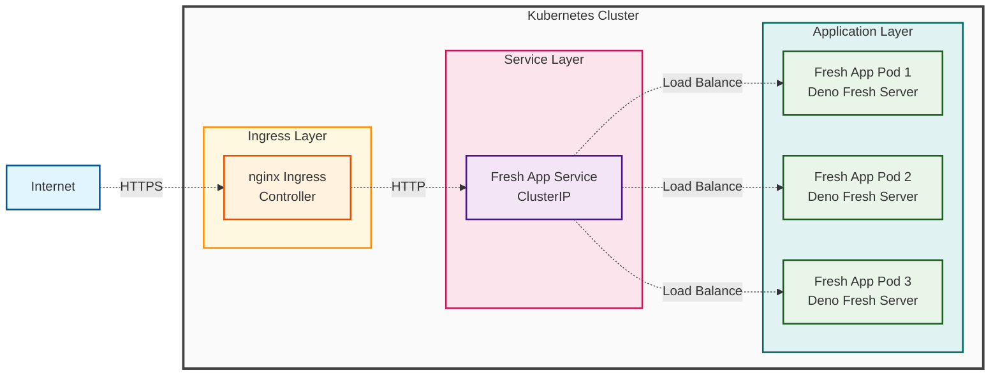

# Deno Fresh on Kubernetes

**Goal**: Run a [Deno Fresh](https://fresh.deno.dev/) application (with [Stripe](https://stripe.com/) integration) on a [Kubernetes](https://kubernetes.io/) cluster:

```mermaid
graph LR
    Internet[Internet]
    Ingress[nginx Ingress<br/>Controller]
    Service[Fresh App Service<br/>ClusterIP]
    Pod1[Fresh App Pod 1<br/>Deno Fresh Server]
    Pod2[Fresh App Pod 2<br/>Deno Fresh Server]
    Pod3[Fresh App Pod 3<br/>Deno Fresh Server]
    
    Internet -.->|HTTPS| Ingress
    Ingress -.->|HTTP| Service
    Service -.->|Load Balance| Pod1
    Service -.->|Load Balance| Pod2
    Service -.->|Load Balance| Pod3
    
    subgraph cluster[" Kubernetes Cluster "]
        subgraph ingress[" Ingress Layer "]
            Ingress
        end
        
        subgraph service[" Service Layer "]
            Service
        end
        
        subgraph app[" Application Layer "]
            Pod1
            Pod2
            Pod3
        end
    end
    
    style Internet fill:#e1f5fe,stroke:#01579b,stroke-width:2px
    style Ingress fill:#fff3e0,stroke:#e65100,stroke-width:2px
    style Service fill:#f3e5f5,stroke:#4a148c,stroke-width:2px
    style Pod1 fill:#e8f5e8,stroke:#1b5e20,stroke-width:2px
    style Pod2 fill:#e8f5e8,stroke:#1b5e20,stroke-width:2px
    style Pod3 fill:#e8f5e8,stroke:#1b5e20,stroke-width:2px
    style cluster fill:#fafafa,stroke:#424242,stroke-width:3px
    style ingress fill:#fff8e1,stroke:#ff8f00,stroke-width:2px
    style service fill:#fce4ec,stroke:#c2185b,stroke-width:2px
    style app fill:#e0f2f1,stroke:#00695c,stroke-width:2px
```
