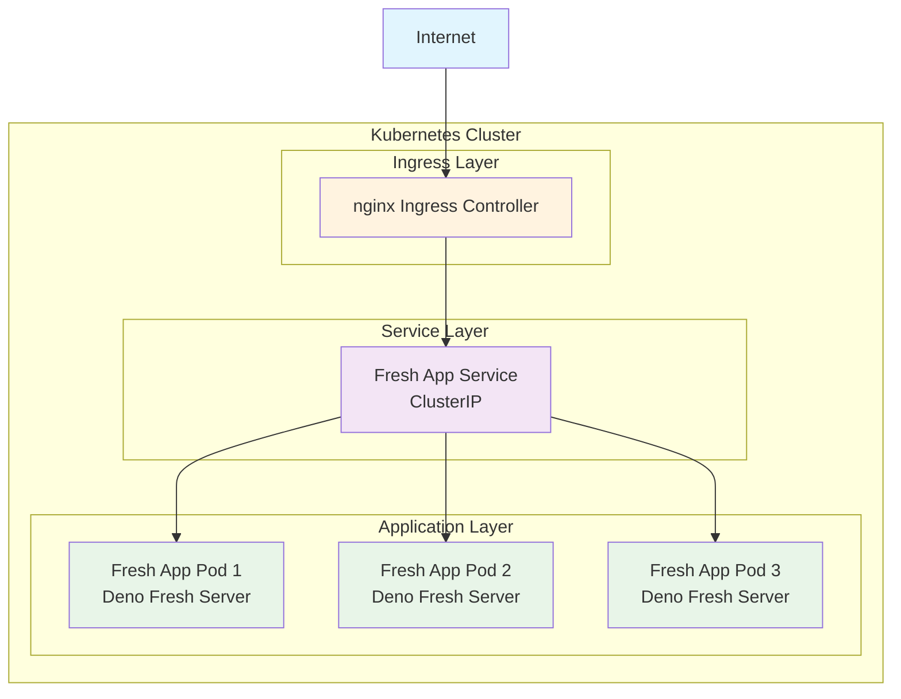

# Fresh

## Kubernetes Deployment Architecture

The following diagram shows how a Deno Fresh application is deployed on Kubernetes with 3 replicas and served through an nginx ingress controller:

This architecture provides:

- **High Availability**: 3 replicas ensure the application stays running even if one pod fails
- **Load Distribution**: Traffic is automatically distributed across all healthy pods
- **External Access**: nginx ingress provides HTTPS termination and routing from the internet
- **Service Discovery**: Kubernetes service handles internal load balancing and pod discovery
